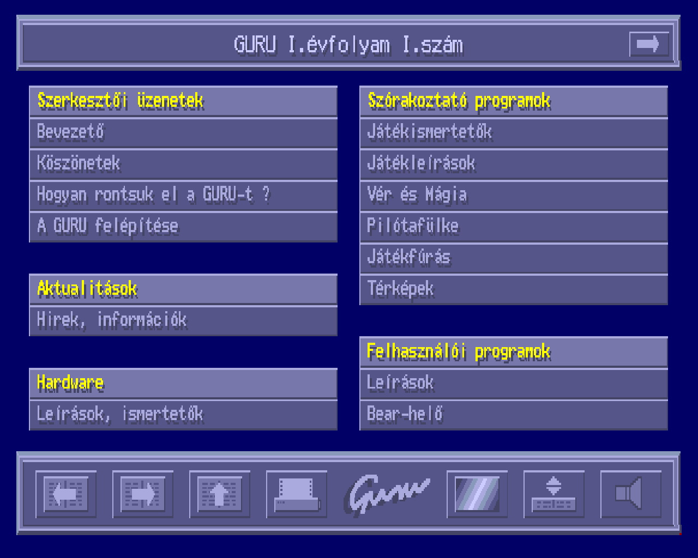

# GURU Amiga diskmag engine (1990-1991)
Source code for the Amiga disk magazine engine, which I designed and wrote
between 1990 and 1991. I was one of the founders of the magazine under
the scene name "Gaborca." In addition to my role as a designer/coder, I also
served as an editor and author, primarily focusing on (3d) graphics topics
on the Amiga.



Additional code credits go to:

- "Poko" Tamás Plósz: Music player
- "Api" Gyula Ujhelyi: Accelerated IFF picture loader

**GURU** was a popular disk magazine in Hungary, and its engine was also
adopted [in Slovakia](https://www.oldgames.sk/diskmags.php?gallery=1406).
In 1992, we transformed the diskmag into a paper-based magazine.
Later, it was renamed to **PC Guru** and became one of the most successful
computer magazines in Hungary. PC Guru continued to be published until 2019.

If you'd like to learn more about GURU and the era, I recommend
checking out the following resources:

- [PC Guru](https://hu.wikipedia.org/wiki/PC_Guru)
Wikipedia article
- [Stamps Back](https://youtu.be/YUqn1OPxtmE)
documentary on Youtube


## About the code
The `main` branch contains the latest version, **v1.31**, as I left it in 1991.
The exception to this includes the `screenshot`, `sample_diskmag` folders, and `README.md`.

This codebase is capable of displaying separately stored (compressed) articles
of various types with an adaptive graphical user interface (GUI),
handling images, music and executing both safe and unsafe programs such as demos.
It also supports a hierarchical menu structure and allows for the printing of articles.

Overall, this version is relatively bug-free due to gradual development.
However, under Amiga OS 2+, there is a minor bug causing a slight offset in the bottom menu screen.
I addressed this issue for the magazine's 20th anniversary edition in 2011,
and you can find the fix in the `anniversary` branch.

Here's a breakdown of the main code files:

- `guru.c`: This file serves as the main module for the disk magazine engine.
- `szerkeszt.c`: It is responsible for editing the table of contents, producing the TOC file.
- `GURUDriver folder`: This folder contains a fake printer driver.
Unfortunately, I don't recall why this component was necessary. :)

When evaluating the code, please keep in mind that, at the time, I had taught
myself the C programming language with the help of the excellent
[book by Brian Kernighan and Dennis Ritchie](https://en.wikipedia.org/wiki/The_C_Programming_Language). 


## Compiling

You need **Manx Aztec C v3.6a**. As at the time I had no idea of the
make tool, you have to compile and link the code manually.

### Diskmag Engine

```shell
cc +L guru.c win.c menu.c art.c list.c music.c iff.c graph.c files.c print.c ppmodul.c
 ```
```shell
ln +c guru.o win.o menu.o art.o list.o music.o iff.o graph.o files.o print.o ppmodul.o ppglue.o icons4.o border.o -lc32
 ```

### TOC editor

In order to compile it, you will need **Reqlib** (not in this repo),
you can find it on
[Fishdisk 0400](http://aminet.net/package/misc/fish/fish-0400).

```bash
cc +L szerkeszt.c
 ```
```bash
ln +c szerkeszt.o areqglue.o -lc32
 ```

## Running
I've included an actual diskmag image from 1991 `sample_diskmag/GURU2_11.ADF`.
Copy the compiled **GURU** executable into the PROGRAM folder on the disk.   

Enjoy! :)
